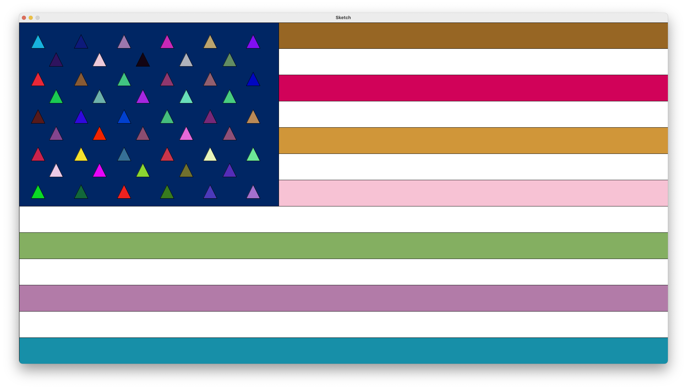

# USA National Flag 🇺🇸
## Description
A Python program draws USA National Flag with random color.
## Drawing

## Reference
- [Python Conditions and If statements](https://www.w3schools.com/python/python_conditions.asp)
- [Drawing basic shapes](https://github.com/leey611/s25cc-python/blob/main/week2-py5/02_primitives_colors.md)
- [Python range() Function](https://www.w3schools.com/python/ref_func_range.asp)