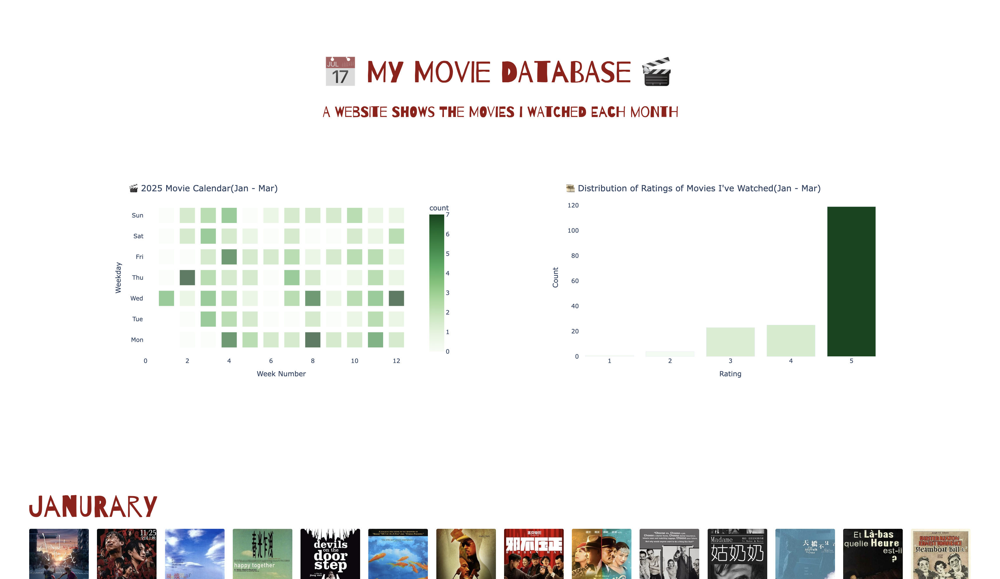

# My Movie Poster Wall 🎞️
## Description
A website analysis and show all the movies I have watched on 2025(Jan - March).
## Preview
  

## Reference
- [seaborn example gallary](https://seaborn.pydata.org/examples/index.html)
- [csvtoJson](https://csvjson.com)
- [Analysing the movies I've watched, Part V, Data visualisation II](https://lovkush-a.github.io/blog/python/data%20science/2020/09/02/mymovies5.html)