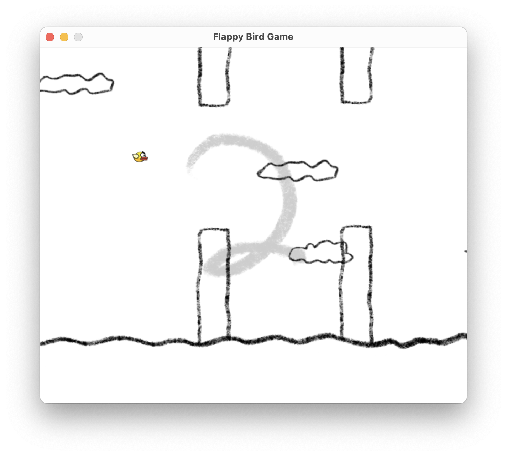
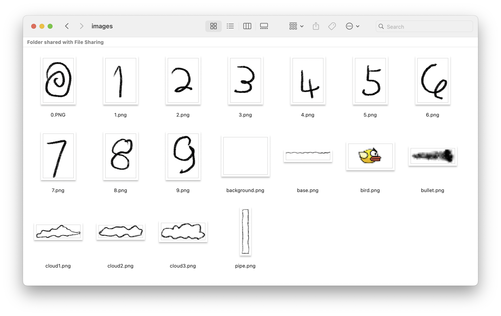

# My Flappy Bird Python Game 🐤
## Description
I modified an existing flappy bird game, I redesigned the art, music, and added bullets to the game.
## Preview
  
  

## Art Design

## Video
- [Demo Video with Sound](https://youtu.be/hYKF7PlF6eE)

## Reference
- [Sound Effects](https://pixabay.com/sound-effects/search/game/)
- [Background Music](https://www.kumeiwp.com/file/39247.html)
- [Original Flappy Bird Game - "How to make Flappy Bird Game in Pygame?"](https://www.geeksforgeeks.org/how-to-make-flappy-bird-game-in-pygame/)
