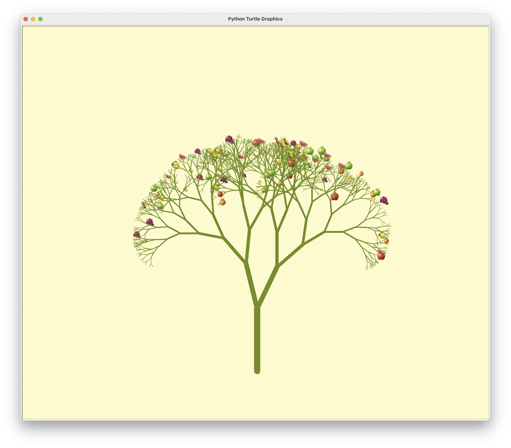

# Plant Illustrations 🍀
## Description
A Python program draws random shapes of tree with fruits on it.
## Drawing

  

  

## Reference
- [Generative art in Python: Fractal Trees](https://youtu.be/EICpm9rnPjE?si=dwFD4w1HlGXxmGXh)