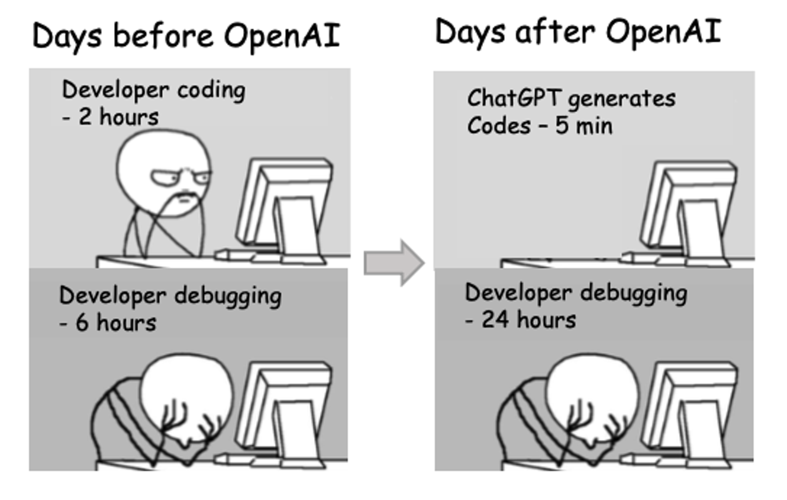

# Creative Coding: Python.A.Sp25
## My Python Projects
### This is a collection of my Python Projects.

## Projects
- [Thonny_USA National Flag 🇺🇸](https://github.com/JiazhenLuo/my_Python_repo/tree/main/Thonny_USAFlag)
  
## Learning Resources
- [入门到精通(Python全栈开发教程)](https://www.bilibili.com/video/BV1wD4y1o7AS/?spm_id_from=333.337.search-card.all.click&vd_source=a644e73e541fb8ec3eec78caf84566e2)
- [【限时特惠】小白玩转Python数据分析](https://www.bilibili.com/cheese/play/ss2298?csource=private_space_class_null&spm_id_from=333.1387.0.0)
- [Python Full Course for Beginners](https://youtu.be/_uQrJ0TkZlc?si=nsrOL7vi9Z47lRz_)

