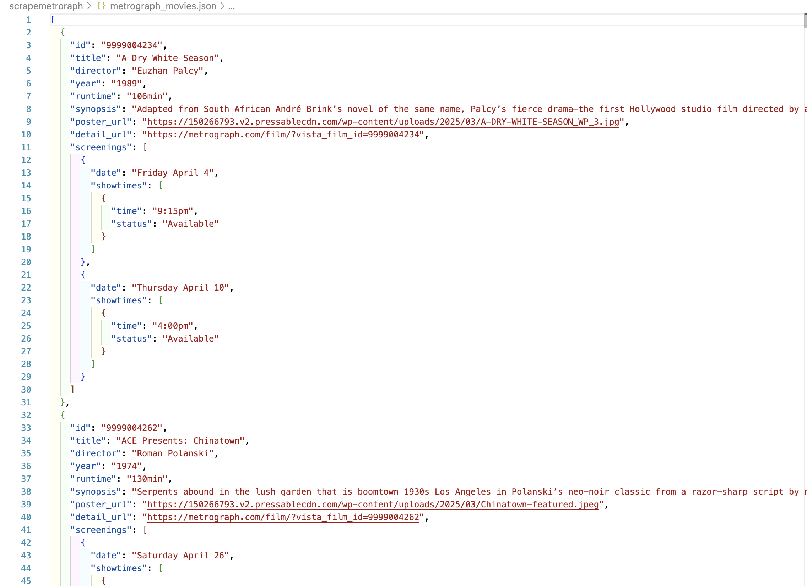
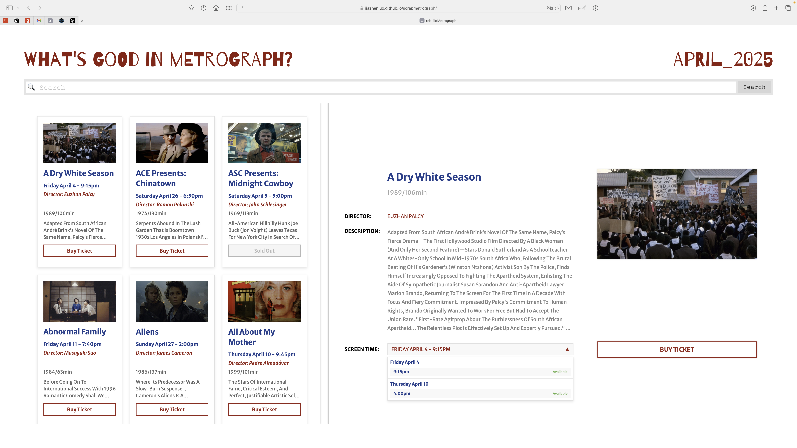

# New Metrograph 🏝️
## Description
I redesigned metrograph with the data I scrapped from their website
## Data:

## Preview:
### Old Version - Nov 15, 2024:

Website Link:
[https://jiazhenluo.github.io/whatsgoodinMetrograph/](https://jiazhenluo.github.io/whatsgoodinMetrograph/)

git repo link:
[https://github.com/JiazhenLuo/whatsgoodinMetrograph](https://github.com/JiazhenLuo/whatsgoodinMetrograph)

### New Version - Mar 29, 2025:

Website Link:
[https://jiazhenluo.github.io/scrapmetrograph/](https://jiazhenluo.github.io/scrapmetrograph/)

git repo link:
[https://github.com/JiazhenLuo/scrapmetrograph](https://github.com/JiazhenLuo/scrapmetrograph)
## Improvements:
There are still a lot of frontend work need to be done, but i will leave it as it is for now.